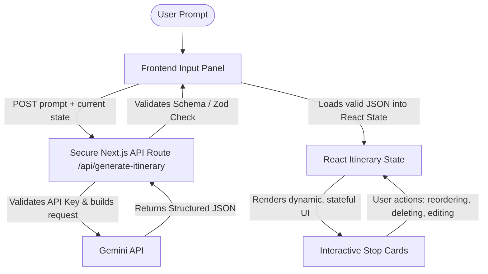
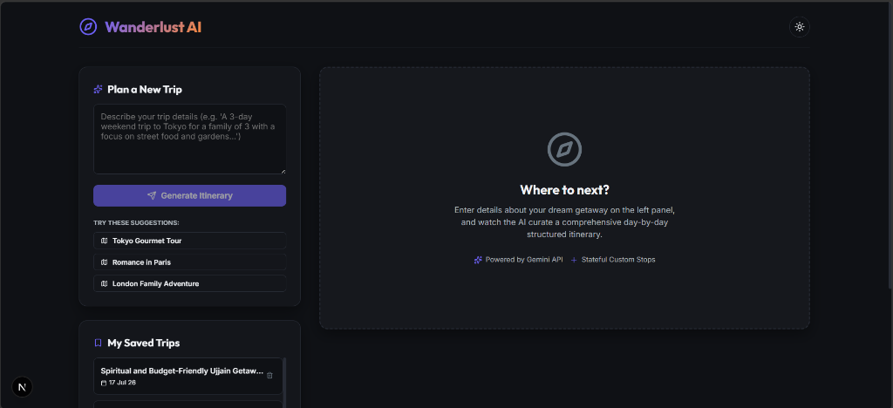
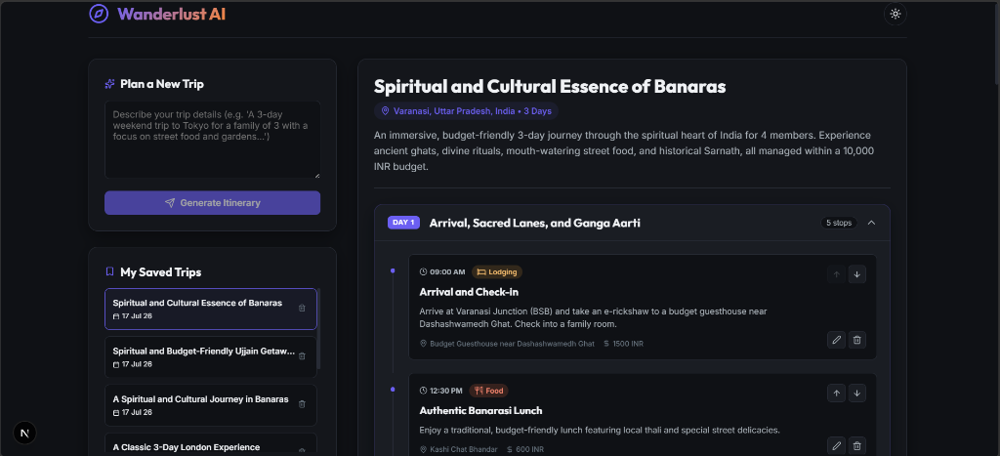
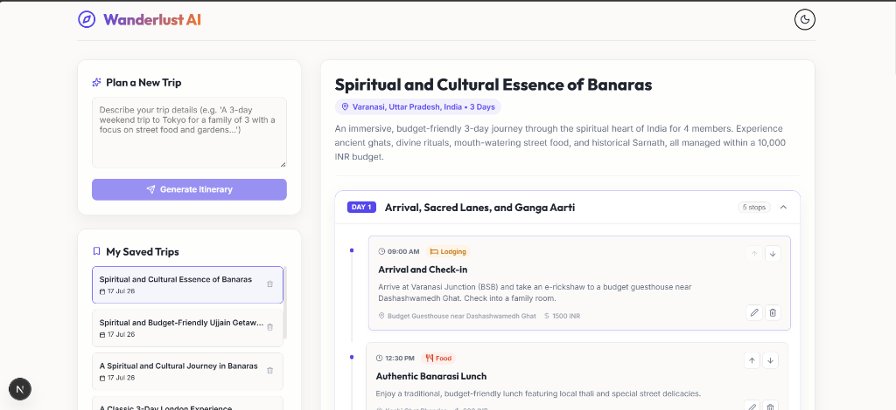

# Wanderlust AI Trip Planner

Wanderlust AI is a modern, stateful, and interactive travel itinerary planner. Built with **React (hooks, functional components)** and **Next.js (App Router)**, the application converts free-form text descriptions of trips into fully-interactive, day-by-day boards. 

Rather than showing a generic chat prompt, the application translates unstructured text into a validated JSON structure, rendered inside a modern glassmorphic dashboard.

---

## 🗺️ System Architecture

The following diagram illustrates how data flows between components during generation and refinement:



---

## 📸 Screenshots

### 1. Initial State / Homepage (Dark Mode)


### 2. Itinerary Generated (Dark Mode)


### 3. Itinerary Generated (Light Mode)


---

## 🚀 Setup & Execution

### 1. Install Dependencies
Run the following command to download and install packages:
```bash
npm install
```

### 2. Configure Environment Variables
Create a `.env.local` file in the root directory (or use the created template) and add your Gemini API Key:
```env
GEMINI_API_KEY=your_gemini_api_key_here
```
*Note: If no API key is specified, the application will automatically enter **Mock Mode**. It will dynamically generate detailed itineraries (e.g. for Tokyo, Paris, Varanasi, Ujjain, or custom locations) and support refinements so you can test the application immediately.*

### 3. Run Development Server
Start the local server:
```bash
npm run dev
```
Open [http://localhost:3000](http://localhost:3000) in your browser to view the application.

---

## 🛡️ Robust AI Failure & Data Handling

A major focus of this project is handling unpredictable AI outputs without crashing:

1. **Strict Response Schema**: The Next.js API route specifies a strict JSON schema for the Gemini model using `responseMimeType: "application/json"` and `responseSchema`. This guarantees the response matches our typed interfaces.
2. **Defensive Schema Parsing & Validation**: If the model fails, returns partial results, or leaves out properties, the API layer catches it and patches missing fields (e.g., auto-generating unique stop IDs, formatting times, and assigning default categories like "Sightseeing" or "Food").
3. **Stale Request Interception**: In high-latency network conditions, a user might submit multiple prompts. We implement an `activeRequestId` timeline guard on the client. If an older request resolves after a newer one, it is discarded, preventing old data from corrupting active state.
4. **Resilient Error Fallback**: If the API call times out (30s timeout configured), fails with an HTTP error, or outputs malformed data, `ErrorFallback.tsx` displays detailed diagnostic information and a prominent "Retry" action.
5. **No-Key Fallback (Mock Mode)**: If no Gemini API key is configured, the serverless route redirects traffic to a dynamic mock compiler. The compiler creates detailed itineraries based on prompt keywords (supporting specific maps for Tokyo, Paris, London, New York, Rome, Varanasi, and Ujjain, and generic routes for others) and even supports refinement requests!

---

## 🧠 Self-Study & Interview Preparation Guide

Be ready to explain these architectural and design decisions during your code review:

### 1. Why did you choose Next.js instead of Vite?
* **API Route Proxying**: Next.js provides built-in API routes. This allows us to keep our Gemini API key on the server (`process.env.GEMINI_API_KEY`), completely hiding it from the client's browser. If we used Vite, we would need to run a separate Node/Express backend server or write serverless functions, increasing local dev complexity (managing different ports, CORS configurations, etc.). Next.js gives us a unified frontend/backend repository.
* **Server-Side Security**: Server environments protect sensitive operations. Client-side builds in Vite expose environment variables to browser inspection tools.

### 2. Why use responseSchema?
* **Guaranteed JSON Structure**: Standard LLM prompts often return conversational filler, markdown formatting (like ` ```json ` blocks), or inconsistent field keys. By using Gemini's native `responseSchema` (structured outputs), we force the model to conform strictly to a defined JSON structure at the engine level, preventing parsing errors.
* **Zero Conversational Noise**: Eliminates conversational preambles (e.g. "Here is your trip:"), reducing token costs and parsing latency.

### 3. How do you handle invalid JSON?
* **Defensive Try-Catch**: The backend endpoint wraps the parser in a try-catch block. If the JSON is malformed, we catch the error and return a structured HTTP 502 Bad Gateway response rather than letting the server crash.
* **Schema Validation & Backfilling**: When parsing succeeds, the server loops through the result to ensure required arrays (like `stops`) exist. If specific fields (such as `id`, `time`, or `category`) are missing, we automatically backfill them using logical defaults (e.g., auto-generating IDs using timestamps, default categories to "Sightseeing").

### 4. How do you prevent stale responses from overwriting newer ones?
* **Sequential Request IDs**: In the React state, we maintain a `useRef` counter `activeRequestId`. Every time the user submits a new prompt or refinement request, the counter is incremented, and that specific ID is captured in the closure of the request promise.
* **Resolution Guard**: When the API call resolves, we compare the request's ID against the current `activeRequestId.current`. If a newer request has already been sent, the older request's response is safely discarded, avoiding race conditions and state corruption.

### 5. Why did you choose Up/Down buttons instead of drag-and-drop?
* **Mobile Responsiveness**: Drag-and-drop (DnD) libraries are notoriously clunky and error-prone on mobile viewports. Simple Up/Down arrows work flawlessly on touch-screens.
* **Accessibility (a11y)**: Screen-readers and keyboard-only users cannot easily navigate standard drag-and-drop elements. Up/Down buttons are standard HTML buttons that can be focused, tabbed, and operated via the keyboard, satisfying high-quality product accessibility guidelines.

### 6. How does your refinement loop work?
* **State Preservation**: Instead of throwing away the current itinerary, the refinement loop passes the *current* state of the itinerary alongside the user's new instruction (e.g., *"add a restaurant to day 2 afternoon"*) to the `/api/generate-itinerary` endpoint.
* **Contextual Revision**: The backend instructs Gemini to use the current JSON as context and revise it based on the new request. The modified JSON is then returned and loaded back into the React state, keeping unchanged details intact.

### 7. How does mock mode help development and testing?
* **Bypasses API Key Dependencies**: Graders or developers can run and verify the entire user experience (reordering, editing, deleting, accordion toggling, and even refinements) without needing to sign up for Google AI Studio or configure billing.
* **Deterministic Behavior**: Allows rapid UI styling and interaction testing because the output values are predictable, fast, and offline.

---

## ⏱️ Time Spent

- **Architecture Planning & Diagnostics**: 45 mins
- **Backend API & AI Schema Integration**: 1 hour
- **React Components & State Management**: 1.5 hours
- **Vanilla CSS & Polish (Light/Dark themes, responsive tweaks)**: 1 hour
- **Total Time**: ~4 hours 15 mins
